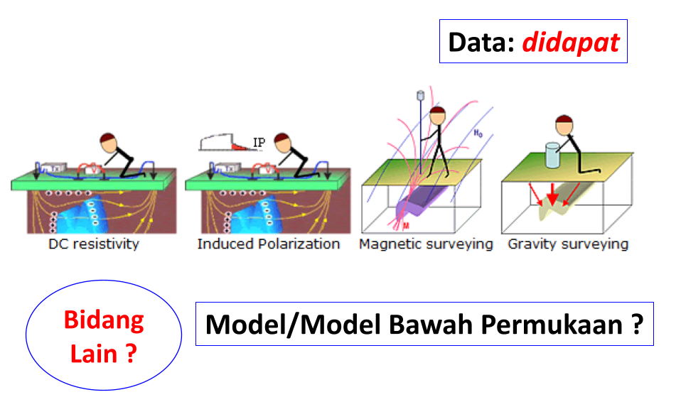
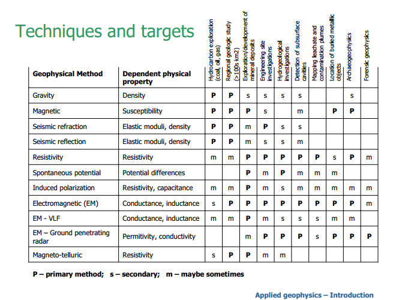

# Pengukuran Geofisika
> Diperbarui: Minggu, 6 November 2016 

Beberapa pengukuran metode geofisika yang umum dilakukan: gravity, magnetik, seismik refraksi, seismik refleksi, dc listrik, spontaneous potential, induced polarization, electromagnetik (EM), EM - very low frequency, EM - ground penetrating radar, magnetotellurik dan lain-lain.

    
    **Gambar 1.** - Gambaran pengukuran metode geofisika[^1]

Ketika melakukan pengukuran metode geofisika di lapangan maka didapatkah **data**. Kemudian dari data tersebut perlu dinterpretasi, baik berupa interpretasi kualitatif ataupun kuantatif untuk bisa menjelaskan kondisi bawah permukaan bumi yang berupa parameter fisis densitas, susceptibilitas, resistivitas dan lain-lain. Parameter fisis bawah permukaan ini biasa disebut sebagai **model** atau model bawah permukaan.

    
    **Gambar 2.** - Metode-metode geofisika dan parameter fisis bawah permukaan[^1]

Interpretasi kuantitatif dengan menggunakan persamaan yang menghubungkan data dengan parameter fisis bawah permukaan, biasanya dinamakan **inversi**.

    
    **Gambar 3.** - Interpretasi parameter fisis bawah permukaan dengan data[^1]

[^1]: Inversion Concept : Introduction Geophysical Inversion. Website: https://gif.eos.ubc.ca/IAG