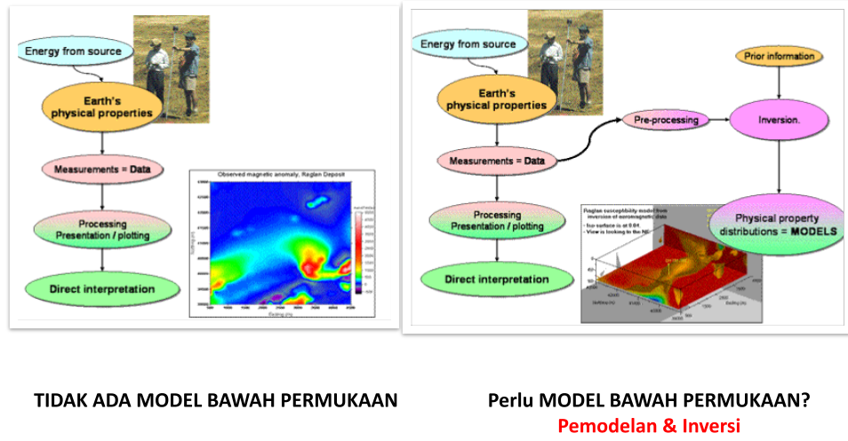

# Kenapa Perlu Inversi?

Berikut ini perbedaan ketika data pengukuran diinterpretasi secara kualutatif dengan kuantitif.

    
    **Gambar** - Interpretasi parameter fisis bawah permukaan dengan data[^1]

Interpretasi kualitatif dilakukan dengan cara melakukan *processing* data dengan menggunakan berbagai metode, biasanya menggunakan filtering/smoothing data kemudian diplotkan hasilnya. Interpretasinya dilakukan dengan mendeskripsikan hasil plot tersebut.

Sementara interpretasi kuantitatif, selain dilakukan plot data hasil *processing* data, juga dilakukan proses **inversi** dengan memakai informasi tambahan dari kondisi lapangan dan plot data sebelumnya. Hasil inversi tersebut berupa model atau distribusi properti fisis bawah permukaan bumi.

[^1]: Inversion Concept : Introduction Geophysical Inversion. Website: https://gif.eos.ubc.ca/IAG